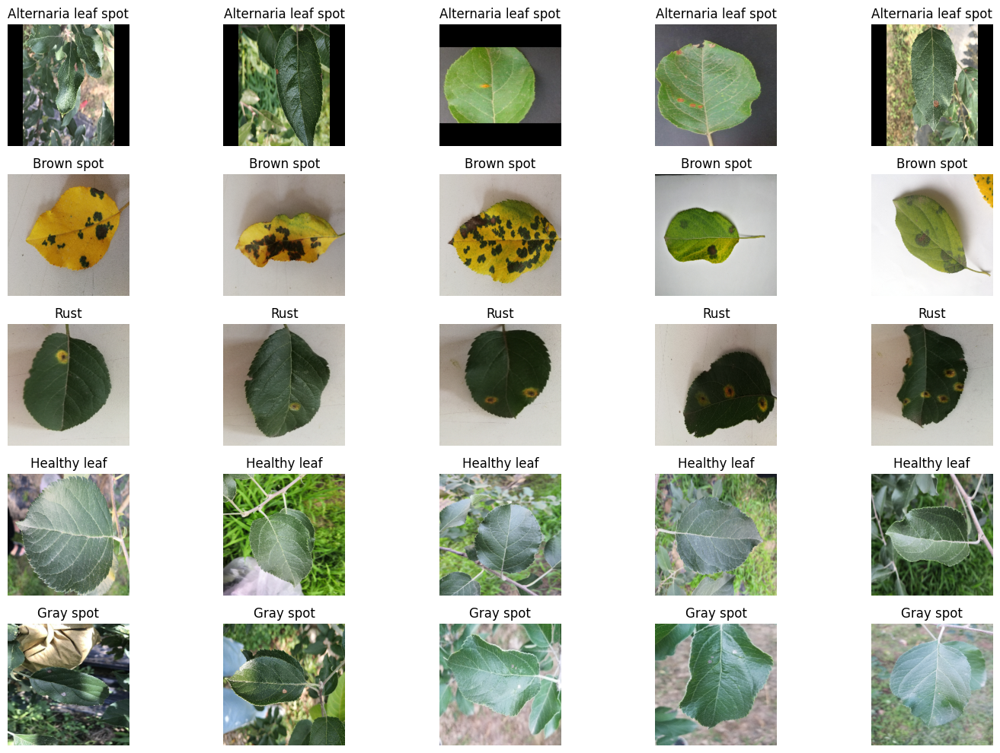

# Apple Leaf Disease Detection

This project focuses on building and evaluating deep learning models for the detection and classification of various diseases in apple leaves using image data. The goal is to accurately identify different disease types to aid in early diagnosis and management.

## Dataset

The dataset used in this project is the [Apple Tree Leaf Disease Dataset](https://www.kaggle.com/datasets/nirmalsankalana/apple-tree-leaf-disease-dataset/data) from Kaggle. It contains images of apple leaves categorized into the following classes:

- Alternaria leaf spot
- Brown spot
- Rust
- Healthy leaf
- Gray spot

The dataset was extracted from a zip file (`archive.zip`) into the `extracted_content` directory.

**Dataset Overview:**

| Category             | Number of Images |
|----------------------|------------------|
| Alternaria leaf spot | 278              |
| Brown spot           | 143              |
| Rust                 | 107              |
| Healthy leaf         | 409              |
| Gray spot            | 266              |

Initial analysis showed that the images have a consistent resolution of (256, 256) and use the RGB color profile. The dataset exhibits class imbalance, with 'Healthy leaf' being the majority class.

## Libraries Used

The following key Python libraries and frameworks were used:

- `pandas`
- `numpy`
- `zipfile`
- `os`
- `random`
- `PIL (Pillow)`
- `matplotlib.pyplot`
- `seaborn`
- `torch`
- `torchvision`
- `tqdm`
- `sklearn`
- `pytorch-gradcam` (for model interpretability)

## Project Structure

The notebook is structured into the following main sections:

1.  **Libraries**: Importing necessary libraries.
2.  **Load the dataset**: Extracting and inspecting the dataset.
3.  **Exploratory Data Analysis (EDA)**: Analyzing dataset characteristics, class distribution, and image properties.
4.  **Data Preparation for Modeling**: Implementing data preprocessing, augmentation, train/validation/test split, and handling class imbalance.
5.  **Modeling**: Building and training deep learning models (Simple CNN and Transfer Learning).
6.  **Model Evaluation**: Evaluating model performance using metrics like accuracy, precision, recall, F1-score, and confusion matrices.
7.  **Model Comparison**: Comparing the performance of the different models.
8.  **Model Interpretability**: (Planned) Using techniques like Grad-CAM to understand model predictions.
9.  **Additional Enhancements**: Discussing potential future work.

## Exploratory Data Analysis (EDA) Summary

The EDA revealed the class distribution imbalance. Image inspection confirmed consistent resolution and color profiles. Analysis of image brightness and contrast showed some variations across categories, potentially serving as distinguishing features.

## Data Preparation

The data preparation involved:

-   Calculating dataset mean and standard deviation for normalization:
    -   Mean (R, G, B): [0.4839, 0.5263, 0.4449]
    -   Standard Deviation (R, G, B): [0.2566, 0.2435, 0.2666]
-   Defining image transformations for training (including data augmentation) and testing (including normalization).
-   Splitting the dataset into 70% training, 15% validation, and 15% testing sets using stratified splitting to maintain class distribution.
-   Handling class imbalance in the training set by oversampling minority classes to match the majority class count.
-   Creating a custom PyTorch `Dataset` class to handle image loading and transformations.
-   Setting up `DataLoader` for efficient batching and shuffling.

## Modeling

Two deep learning modeling approaches were implemented and evaluated:

### Simple CNN

A custom convolutional neural network architecture was designed and trained from scratch.

-   **Architecture**: Consists of multiple convolutional layers with ReLU activation and Batch Normalization, followed by max pooling, dropout for regularization, and fully connected layers for classification.
-   **Loss Function**: Cross-Entropy Loss.
-   **Optimizer**: Adam optimizer.
-   **Training**: Trained for 20 epochs.

### Transfer Learning (ResNet50)

A pretrained ResNet50 model was used as a feature extractor, with a new classification head added and trained.

-   **Pretrained Base**: ResNet50 loaded with weights trained on ImageNet, excluding the original classification head.
-   **New Head**: A global average pooling layer followed by a linear layer for classification.
-   **Training Strategy**:
    -   The parameters of the pretrained ResNet50 base were initially frozen.
    -   Only the parameters of the new classification head were trained for 10 epochs with an Adam optimizer.
    -   *(Note: Fine-tuning of the pretrained layers was planned but not fully implemented in the provided notebook snippets.)*

## Model Evaluation and Comparison

Both models were evaluated on the held-out test set using various metrics.

### Simple CNN Model Performance

*   **Overall Test Accuracy:** 0.9337
*   **Per-Class Evaluation Metrics:**
    *   Alternaria leaf spot: Precision: 0.9535, Recall: 0.9762, F1-score: 0.9647
    *   Brown spot: Precision: 1.0000, Recall: 1.0000, F1-score: 1.0000
    *   Gray spot: Precision: 0.8261, Recall: 0.9500, F1-score: 0.8837
    *   Healthy leaf: Precision: 1.0000, Recall: 0.8710, F1-score: 0.9310
    *   Rust: Precision: 0.8824, Recall: 0.9375, F1-score: 0.9091

### Transfer Learning Model Performance

*   **Overall Test Accuracy:** 0.9724
*   **Per-Class Evaluation Metrics:**
    *   Alternaria leaf spot: Precision: 1.0000, Recall: 0.9286, F1-score: 0.9630
    *   Brown spot: Precision: 1.0000, Recall: 1.0000, F1-score: 1.0000
    *   Gray spot: Precision: 0.9091, Recall: 1.0000, F1-score: 0.9524
    *   Healthy leaf: Precision: 0.9841, Recall: 1.0000, F1-score: 0.9920
    *   Rust: Precision: 1.0000, Recall: 0.8750, F1-score: 0.9333

**Comparison:**

Comparing the overall test accuracies, the Transfer Learning model (0.9724) significantly outperformed the Simple CNN model (0.9337). The transfer learning approach, leveraging features learned from a large dataset, resulted in better generalization and higher accuracy on the unseen test data. The per-class metrics also generally show better performance for the Transfer Learning model, particularly in terms of precision and F1-scores for most classes.

## Additional Enhancements

Potential future work includes:

-   Implementing and evaluating fine-tuning of the pretrained layers in the transfer learning model for further performance optimization.
-   Testing the model's generalization on external apple leaf datasets.
-   Applying model interpretability techniques like Grad-CAM or saliency maps to understand which image regions are most important for predictions.
-   Packaging the trained model into a web or mobile application using frameworks like Streamlit or TensorFlow Lite for practical use.
